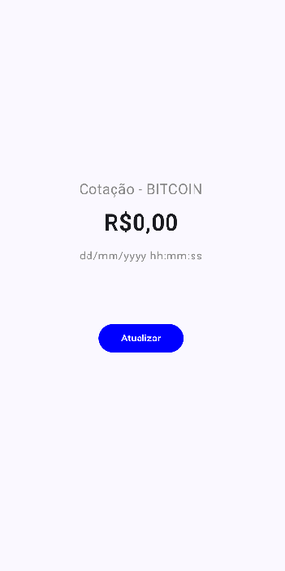

# fiap-3sis-android-kotlin-cryptomonitor-jetpackcompose

1. [Sobre](#sobre)
2. [Estrutura](#estrutura)

## Sobre

O projeto Cryptomonitor é uma aplicação Android criada para verificação da cotação mais atual de BITCOINs.

A página inicial da aplicação apresenta informaçãoes básicas sobre a quotação, a data e hora atual e um botão para atualização do valor da quotação bem como da data/hora.

Ao pressionar o botão "Atualizar", os valores são modificados. A cada vez que essa ação se repete, a mudança dos valores de acordo com a data/hora é percebida.

## Estrutura

O projeto foi construído com o Android 35, utilizando o Gradle como compilador e o Java 11.

Para obter os resultados apresentados, há o consumo da API do [Mercado Bitcoin](https://www.mercadobitcoin.net/), que retorna informações da moeda escolhida (chamadas de Ticker, tais como:
- Última cotação
- Data da cotação

Essas informações (e outras) são convertidas na classe Kotlin [TickerResponse](./app/src/main/java/jamilligioielli/com/github/cryptomonitor/TickerResponse.kt), que é utilizada pelo [serviço responsável](./app/src/main/java/jamilligioielli/com/github/cryptomonitor/MercadoBitcoinService.kt) pela chamada dos endpoints (rotas) dessa API, convertendo a resposta em classe Kotlin.

Com isso, na [principal Activity](./app/src/main/java/jamilligioielli/com/github/cryptomonitor/MainActivity.kt) do projeto, além de disparar a chamada a essa API através do acionamento do botão "Atualizar", as informações dela são recuperadas e devidamente exibidas nos componentes criados na tela.
Em caso de erro, dentro da Activity ainda há um tratamento para exibir uma mensagem mais amigável ao usuário em formato de PopUp (Toast) - além de evitar prejudicar a execução da aplicação.